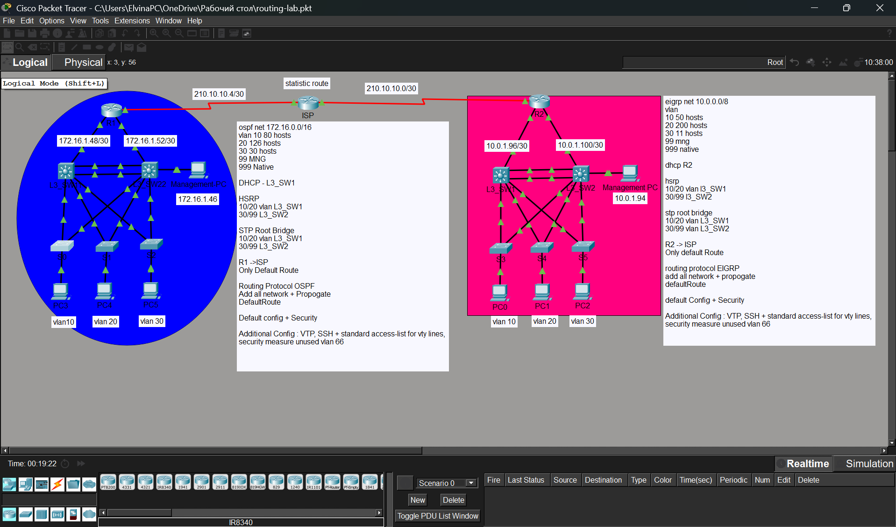

# Cisco Packet Tracer Routing Lab

This project is a Cisco Packet Tracer routing and switching lab designed to practice enterprise network configuration.

## Technologies Used

- VLANs
- VTP
- DHCP
- OSPF
- EIGRP
- Static routing
- HSRP
- SSH
- Standard ACL for VTY lines
- PortFast
- BPDU Guard
- Unused VLAN security configuration
- DTP is disabled on all switch-to-switch links to prevent unwanted dynamic trunk negotiation.
  
  ## Topology

## Network Overview

The topology includes multiple VLANs, Layer 3 switches, routers, and an ISP connection.  
The lab demonstrates inter-VLAN routing, dynamic routing, redundancy, remote management security, and basic WAN connectivity.

## VLAN Design

| VLAN | Purpose |
|---|---|
| VLAN 10 | User network |
| VLAN 20 | User network |
| VLAN 30 | User network |
| VLAN 99 | Management |
| VLAN 999 | Native VLAN |
| VLAN 66 | Unused ports security |

## Routing

The lab uses OSPF and EIGRP for dynamic routing.  
A static default route is configured toward the ISP.

## Redundancy

HSRP is configured to provide gateway redundancy for user VLANs.

## Security
SSH is configured for secure remote access.  
A standard ACL is applied to VTY lines to restrict management access.  
Unused ports are assigned to an unused VLAN for basic Layer 2 security.  
DTP is disabled on all switch-to-switch links to prevent unwanted dynamic trunk negotiation.
PortFast and BPDU Guard are configured on access ports to improve convergence and protect against accidental switch connections.

## Files

- `routing-lab.pkt` — Packet Tracer topology file
- `topology.png` — Network topology screenshot
- `configs/` — Device configuration files
